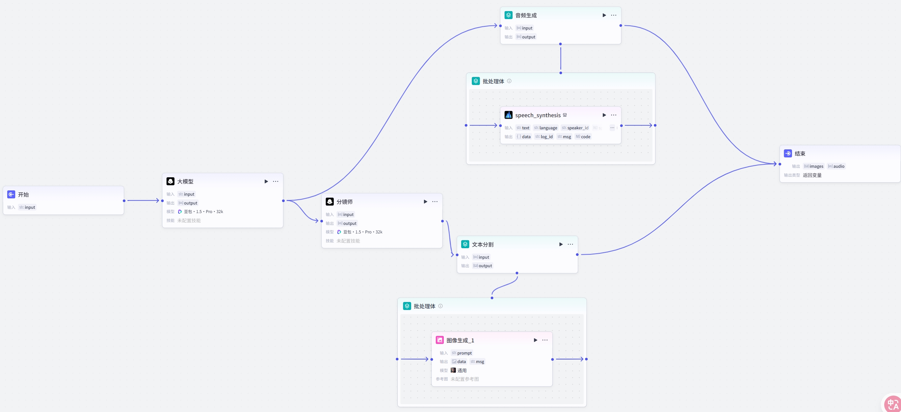

<center>

</center>

# EduBuddy-儿童教育智能体

:blush: Tap, Play, Learn the EduBuddy Way!

:revolving_hearts: 让父母的陪伴不再受时空限制，让孩子的教育从此千人千面

:sparkles: 中关村黑客松项目第三名

## Demo

## 作品介绍


## 实现思路


- 基于`vue3`的前端界面
- 基于`Chatgpt-4.1`模型搭建故事生成Agent
- 基于`Coze`平台搭建图像+音频生成Agent



## How To Use?
1. 克隆本仓库至本地
2. 安装必要的依赖
    ```bash
    npm i
    ```
3. 替换以下文件中的`accesstoken`
    ```plaintext
    src\config.js line6
    src\api\index.js line107
    src\api\index.js line112
    ```
4. 运行项目
    ```bash
    npm run dev
    ```